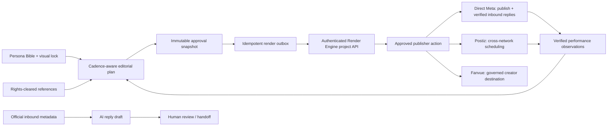

# Creator Promotion Control-Plane Runbook

This runbook describes the contained Creator Promotion desk in Media Engine:
persona-led social planning, approved rendering, managed destinations, and
draft-only inbound support. It is an operator control plane, not an account
farm, device farm, proxy manager, credential store, or mass-messaging system.

## Decision from the reference video

The referenced Devicefarm.io video centralizes account management, scheduling,
chat routing, and funnel monitoring. Those are useful operating concepts.
Its implementation, however, relies on device fingerprints, proxies, bulk
account creation, account-link obfuscation, follow automation, and chatbot
redirects. Media Engine must not adopt those mechanisms.

The replacement is a smaller, more durable architecture:

Every arrow that reaches an external provider is disabled until its official
connection, server-side resolver, and individual approval are present.

## What is already implemented

- A contained `/creator-promotions` desk rather than a replacement for the
  wider Media Engine.
- Persona bible: public identity, emotional backstory, voice, audience,
  content pillars, boundaries, versioned prompt lock, and visual style.
- Owned-account registry for authorised accounts only. It stores no password,
  proxy, OTP, device, or access token.
- Cadence-aware planning for three to seven posts with balanced, growth,
  story-led, and conversion-aware profiles. Plans explicitly include reels,
  carousels, and stories and preserve caption, CTA, rationale, and prompt
  snapshots.
- Instagram-format preview and a calendar view with rescheduling and review.
- Rights-cleared reference-image upload, provenance, signed preview, and
  immutable content-plan linkage.
- Brand/partner routes and Fanvue destination records. Fanvue requires an
  official connection, creator KYC, disclosure, and age-gate review before a
  subscription CTA can proceed.
- Inbox intake for a concise, non-sensitive operator summary; AI drafts only;
  human handoff; no automatic outbound message.
- On approval, a content plan creates one idempotent render job and matching
  `actionLedger` action. The render-review queue shows queued, running,
  candidate-ready, selected, and failed attempts; selecting a candidate never
  publishes it.
- Manual entry of verified provider analytics for the learning loop. Entries
  are never auto-summed across incompatible reporting windows.
- Global Meta, Fanvue, Postiz, and Render Engine readiness cards that reveal
  configuration gaps without exposing secret values.
- Postiz is the optional self-hosted, cross-network scheduling executor. It
  is deliberately downstream of Media Engine: a frozen, individually approved
  item can be scheduled into its selected Postiz channel, but the Postiz
  calendar never becomes the authority for persona, funnel, asset, or approval
  state. A Postiz receipt means **scheduled with Postiz**, not confirmed
  publication on the social network.

## Operating sequence

1. Create or import an authorised creator profile.
2. Complete the persona bible and visual lock before generating content.
3. Register an existing authorised account; do not create social accounts
   through the desk.
4. Add only creator-owned, licensed, or consented reference images. Real
   likeness references must be creator-owned or consent-verified.
5. Record a brand/partner or Fanvue destination with accurate disclosure.
6. Select a cadence profile and generate a plan. Inspect the calendar,
   Instagram preview, caption, CTA, and "why now" rationale.
7. Request review. Approval freezes the snapshot and admits a single immutable
   render attempt.
8. Start the permitted render from the queue. The dedicated Trigger worker
   claims only that frozen attempt, rehosts provider output to controlled
   storage, and exposes candidates for review.
9. When a configured renderer produces verified media, select a candidate
   before an individually approved publish action.
10. For a cross-network schedule, connect the owned channel in Postiz first,
    then link that Postiz integration to the creator's account in Media
    Engine. Request approval and explicitly hand the frozen schedule to
    Postiz. It records an acceptance receipt; reconcile the eventual network
    result before treating it as published.
11. Record verified results from the official provider surface and use them as
    context for the next plan.
12. For inbound conversations, record a minimal summary, request a draft if
    appropriate, and send only after a human review in the official provider
    interface or a future individually approved dispatcher.

## Activation requirements

### Meta / Instagram

- Official Meta app and approved Professional Instagram account flow.
- `META_APP_ID`, `META_APP_SECRET`, `META_GRAPH_API_VERSION`,
  `META_OAUTH_REDIRECT_URI`, and `META_WEBHOOK_VERIFY_TOKEN` configured in
  the server environment or vault.
- A server-only `META_ACCESS_TOKEN_RESOLVER`, callback handler, webhook
  verifier, and approved dispatcher.
- Per-account scopes and capabilities verified before insights, publishing, or
  inbound-reply workflows become available.

### Inbox Draft AI

- The Creator desk can generate a server-only **draft** from a minimised,
  redacted verified inbound message, the creator's voice guide and boundaries,
  and an active compliant funnel. The browser cannot provide its own model
  context, raw recipient identity, destination link, or override prompt.
- Configure the private deployment-only `CREATOR_OPENAI_API_KEY`, an explicit
  `CREATOR_LLM_MODEL`, and `CREATOR_LLM_ENABLED=true`; the global Media Engine
  AI kill switch must also be enabled. A ChatGPT subscription login is not a
  deployable server credential. The readiness card is static and never probes
  the model provider when the desk loads.
- The installed Creator runtime uses the Responses API with `store:false`, no
  tools, a 30-second request timeout, and a 2,048-token hard output limit. It
  never logs model prompts, drafts, headers, or provider error bodies. Start
  with a project-scoped key and a low provider-side spend limit before enabling
  it for operators.
- Drafts never send by themselves. A signed inbound proof, the provider reply
  window, disclosure requirements, and an individual review still gate the
  separate Meta reply action.
- Subscription, age-gated, safety-flagged, and Fanvue-interest conversations
  are intentionally handed to a person. The generator must not select a paid
  CTA, emit a direct link, or simulate a personal adult conversation.

### Fanvue

- Fanvue agency/partner approval and the creator's required KYC.
- `FANVUE_CLIENT_ID`, `FANVUE_CLIENT_SECRET`, `FANVUE_API_VERSION`,
  `FANVUE_OAUTH_REDIRECT_URI`, `FANVUE_WEBHOOK_SIGNING_SECRET`,
  `FANVUE_APPROVED_DISPATCHER=server_only`, and
  `FANVUE_ACCESS_TOKEN_RESOLVER=fanvue:account-v1` in the server environment
  or vault. Enable a production write only with
  `CREATOR_FANVUE_TRACKING_LINKS_ENABLED=true`.
- Store each OAuth-connected creator token only in the server account vault
  under `FANVUE_ACCESS_TOKEN_<connection-id>`; never in Convex, browser state,
  a prompt, or a destination record. The OAuth callback still owns token
  rotation and actual granted-scope/health evidence.
- The currently installed approved dispatcher is deliberately narrow: it can
  create one named Fanvue tracking link after an active KYC-verified,
  age-gated, disclosed Fanvue destination and an active approved funnel both
  match the frozen request. The request → individual approval → explicit
  Trigger handoff → receipt sequence has no automatic retry; an interrupted
  request is reconciled manually to avoid duplicate links.
- No Fanvue post, chat, mass-message, payment, account-creation, or unverified
  inbound-reply dispatcher is enabled by this feature.
- Fanvue must be used only for lawful, age-gated, fully disclosed content and
  only after the provider's own onboarding conditions are satisfied.

### Postiz cross-network scheduler

Postiz is a separately deployed, self-hosted **execution service**, not a
replacement Media Engine. Use it to connect and schedule authorised X,
Instagram, TikTok, Facebook, Threads, Pinterest, YouTube, LinkedIn, Bluesky,
and other supported channels. Keep one Postiz group/channel relationship per
creator/account so the same Postiz integration cannot silently be used by a
different persona.

- Deploy Postiz separately with its documented PostgreSQL, Redis, Temporal,
  persistent/media storage, HTTPS reverse proxy, and a stable public domain.
  Cloudflare R2 is suitable for Postiz media storage as well as Media Engine
  controlled assets.
- Configure each social network's own developer app/OAuth flow in Postiz;
  Media Engine never receives passwords, OTPs, proxies, browser profiles, or
  network OAuth secrets. An operator can use the desk's explicit **Refresh
  Postiz channels** control to read a sanitized channel list from the
  configured instance, then select one channel for an operator-attested
  mapping. Refreshing never auto-links, schedules, or publishes. Link the
  resulting Postiz integration to the owned creator account through the
  Creator Promotion desk.
- Select the network policy for each individual approved schedule, rather than
  storing a one-size-fits-all policy on the account. The frozen approval
  snapshot records the Instagram connection subtype, X reply/disclosure
  settings, TikTok audience/interactions/AI and commercial declarations,
  YouTube visibility and made-for-kids declaration, or the Pinterest board.
  Instagram carousels remain manual until a multi-asset schedule is reviewed;
  TikTok requires a selected video and Direct Post approval.
- Configure `POSTIZ_URL`, a server-only Postiz API key through the approved
  vault/runtime boundary, `POSTIZ_APPROVED_DISPATCHER=server_only`, and
  `CREATOR_POSTIZ_SCHEDULE_ENABLED=true` only after a staging acceptance run.
  The task must be deployed with the Media Engine service token.
- The handoff worker first gives Postiz a controlled, sufficiently long-lived
  HTTPS render URL, then schedules only the Postiz-owned media asset. It does
  not retry an ambiguous network request, because a retry could duplicate a
  scheduled post.
- TikTok, Meta, X, and other platform restrictions remain in force. In
  particular, TikTok Direct Post needs its own app review/audit and a public
  HTTPS media domain; Postiz cannot bypass those platform gates.
- Keep direct Meta for the verified inbound Instagram message/reply path. A
  generic scheduler must not be allowed to infer a recipient or response
  window for the chatbot.

### Render Engine creator images

- Deploy the `generate-creator-promotion` Trigger task and configure
  `TRIGGER_SECRET_KEY_MEDIA_ENGINE` in the `trigger` vault service.
- Configure `MEDIA_ENGINE_CONVEX_SERVICE_TOKEN`; it is required for the
  worker to claim or complete a render attempt.
- Configure `RENDER_ENGINE_PROJECT_API_URL` and the Media Engine project
  capability in Trigger or the `media-engine` vault service. Enroll the
  project with the dedicated `media-engine` R2 output bucket.
- Image, carousel, and static-story content uses the Final Nano Banana Pro
  profile through the project API. The worker verifies the image and its R2
  checksum before recording a review candidate. Video and creator LoRA
  profiles remain unavailable until their exact Render Engine routes qualify.

### Deployment recovery

Before deploying, identify the actual Media Engine Vercel project and alias.
The local `.vercel` link must be verified before it is changed; do not delete
or relink it speculatively. Confirm that production has the Media Engine
service token and all required provider variables, deploy the branch, then
verify `/creator-promotions` and `/api/creator-promotions` at the intended
production alias.

## Explicit non-goals

- Device, browser, fingerprint, proxy, OTP, or password automation.
- Bulk social-account creation, account-link concealment, or follow/view
  automation.
- Cold or mass direct messaging.
- Scraping public images or using an unconsented real-person likeness.
- Automated purchase, payment, subscription, or contract commitment.
- Treating an AI draft, queue entry, preview, or configuration record as proof
  of an external action.

## Verification checklist

- The page loads only for an authenticated operator.
- The protected route fails closed without the Media Engine Convex service
  token.
- A planned post has an immutable prompt/reference snapshot before approval.
- Approval creates at most one render job/action pair for its content-review
  version; retries create a separate, capped immutable attempt.
- An unconfigured renderer records a failed attempt before it can make a
  provider call; blocked/unassigned work cannot be claimed at all.
- Candidate media is stored in Media Engine R2 under
  `projects/media-engine/jobs/…` for new Engine images or
  `creator-renders/…` for historical renders. It must be explicitly selected
  and still is not a published post.
- A Postiz action can be requested only for a selected rendered asset, a
  future local schedule, and a connected, capability-approved Postiz channel.
  Its immutable snapshot contains the selected integration, asset version,
  content format, and approved per-network policy. Schedules with less than a
  minute of lead time are rejected rather than being allowed to become an
  accidental immediate post.
- A successful Postiz action records only the Postiz schedule receipt. It must
  not set a content item to `published`; a later verified platform result is
  required for that assertion.
- No inbox path sends a message without a future, individually approved
  official-provider dispatcher.
- Creator AI readiness is configuration-only: loading the desk never probes a
  model provider. The planner and inbox draft paths require the global AI gate,
  `CREATOR_LLM_ENABLED=true`, a private API key, and an explicit model before
  they can make a bounded draft-only request.
- Only verified observations enter the performance ledger.
- Production verification proves the intended Vercel alias serves both the
  page and its API route.
