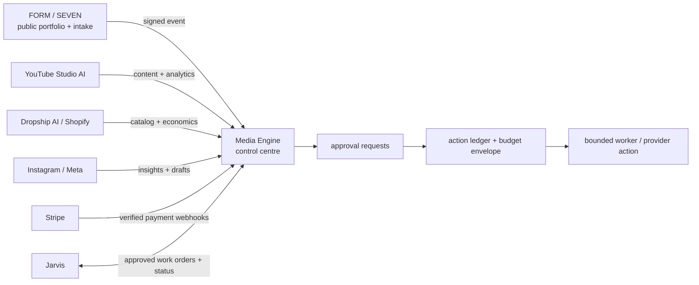

# Media Engine — unified operating model

Media Engine is the protected operating hub for Daniel's portfolio. It is not a
replacement for the specialist applications: it joins their approved events,
creative work, revenue signals, and human decisions in one controlled place.

## What is live today

- **Private Client Work**: operator-reviewed Fiverr and direct client work,
  scripted intake, versioned storyboards, and fail-closed Seedance production.
- **FORM / SEVEN**: public portfolio, service enquiry, free-sample intake, and
  payment-link presentation. It remains the public front door, not the system
  of record for client fulfilment.
- **Specialist spokes**: YouTube Studio AI, Dropship AI, DB Cinema, App Factory,
  Music House, and Jarvis have their own data and deployment boundaries.

No external social account, marketplace, store, email sender, ad account, or
payment provider is treated as connected merely because old code or a vault
entry exists. Connection state must be recorded and attested.

## Spoke audit and rollout order

| Spoke | Safe signal to add first | Current hard stop |
| --- | --- | --- |
| FORM / SEVEN | Signed, deduplicated intake receipt and operator qualification state. | An intake is not consent for marketing, a render, or an email. |
| YouTube Studio AI | Fresh, provenance-bound channel/video snapshots plus publish-intent status. | A new server-only snapshot/outbox contract is required; OAuth and R2 material stay in Studio. |
| Dropship AI / Shopify | Raw sync health, aggregate order/revenue, product counts, and verified-margin count. | Existing funnel, trend, social, and zero-cost margin values are not optimisation truth. No prices, purchases, fulfilment, refunds, or supplier actions. |
| Instagram / Meta | Professional-account OAuth, read-only insights, and calendar drafts. | There is no direct Meta connection yet. Generic social fan-out is not a managed Instagram integration. |
| Stripe | Verified webhook payment status and bounded service fulfilment state. | A payment-link redirect or link issued is never a paid event. |
| Jarvis | Signed summaries, anomalies, approval-needed signals, and operator-visible suggestions. | Jarvis worker/admin capabilities and vault credentials must not be shared with Media Engine. |
| Fiverr and outreach | Manual marketplace intake/reply drafts; consented email audiences with verified sending identity. | Fiverr has no supported seller automation boundary here. Cold email, newsletters, and replies stay approval-gated. |

### Delivery sequence

1. Deploy the control plane, Control Center, and FORM / SEVEN receipt bridge.
2. Add bounded FORM retry delivery and promote qualified requests to a client-work draft—never directly to a paid render.
3. Add read-only YouTube and Shopify snapshot feeds with source freshness and metric definitions.
4. Build the dedicated Meta professional-account connection for insights and scheduled drafts.
5. Add Stripe webhook-confirmed lifecycle updates and consented email infrastructure.
6. Give Jarvis a one-way, signed intelligence feed; it can surface work and approvals but cannot obtain Media Engine execution credentials.
7. Introduce experiments only after outcomes are attributable; budget envelopes remain hard caps and send/publish/spend stays approved.

## Non-negotiable action policy

Every consequential action begins as a proposed, immutable record:

1. An intake, agent, or operator proposes a plan.
2. Media Engine stores the snapshot and asks for an explicit approval when the
   policy class requires one.
3. An `actionLedger` entry reserves any relevant budget and carries an
   idempotency key before a worker can run.
4. A narrow worker capability is consumed once. The provider receipt, actual
   cost, outcome, and error are written back to the ledger.

This protects client work, subscription credits, paid media, marketplace
compliance, and customer trust. It also creates clean attribution data before
any learning system can make strategy recommendations.

### Always human-approved

- Fiverr, Upwork, Contra, and PeoplePerHour buyer messages and deliveries.
- Cold-email launches, newsletter sends, and audience imports.
- Public publishing on social or YouTube.
- Paid-media budget changes, spend, merchant pricing, refunds, purchases, and
  fulfilment changes.
- Any action touching a customer payment or a client-owned account.

### Eligible for bounded automation after connection

- Receiving signed inbound events and validating/reconciling them.
- Read-only analytics, catalog, and account-health synchronisation.
- Creating drafts, calendars, briefs, creative variants, and recommended
  experiments.
- Rendering an already approved client plan through its exact approved
  provider/model policy.

## First governed vertical slice

The control-plane foundation attaches to the existing Client Work render path:

- organizations identify the agency, portfolio brands, clients, and partners;
- integration connections describe capabilities and health without storing
  tokens;
- immutable approvals preserve the version of a plan that was accepted;
- the action ledger joins a render, provider cost, Trigger run, and outcome;
- budget envelopes exist before any paid-media executor can be introduced.

The first ledger-backed side effect is an approved Seedance render. This proves
the model on a real billable operation before it is extended to email, social,
ads, or commerce.

## Connection order

1. **FORM / SEVEN** — persist its own form submission and private references,
   then deliver a signed, replay-safe event into Media Engine. A submission is
   never an automatic render, email, or payment.
2. **YouTube Studio AI** — read-only channel and asset analytics, then approved
   publishing requests.
3. **Instagram / Meta** — professional-account OAuth, read-only insights and
   calendar drafts first; approved publishing later.
4. **Shopify / Dropship AI** — catalog and economic read model first; approved
   product/content changes only after source and margin validation.
5. **Stripe** — webhook-confirmed payments and fulfilment state. A payment link
   issued or browser redirect is never counted as paid.
6. **Email / newsletter** — client-owned consented audience, verified sending
   identity, unsubscribe controls, and approved sends. Inbound client requests
   are not marketing consent.

## Learning and strategy

Media Engine should not use open-ended reinforcement learning against real
spend. It first records truthful outcome attribution (creative, channel,
audience, cost, conversion, and confidence), then runs bounded experiments
within a human-approved budget. Recommendations may become more autonomous only
after the actual connector data, a defined objective, and a reversible policy
are in place.

## Retired code

Historical campaign, CRM, lead, publishing, and orchestration modules stay
retired. New work is built beside the private Client Work implementation and
cannot quietly reactivate old autonomous paths.
